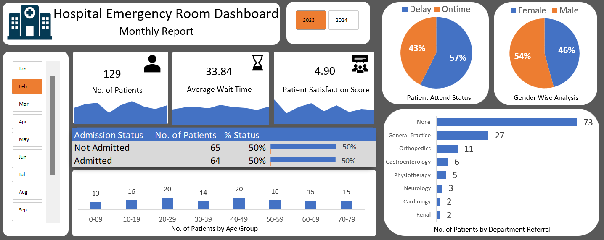

# Hospital Emergency Room Dashboard (Excel)

This project features an interactive Excel-based dashboard that visualizes key performance metrics of a hospital emergency room (ER). It includes dynamic visualizations, slicers for filtering data by month and year and sheet-level interactivity.

## Preview

## Features

- **Interactive Dashboard**: Displays monthly ER statistics such as number of patients, average wait time, patient satisfaction score and more.
- **Sheet Navigation**: Clickable area charts redirect to detailed data sheets, with a home icon to return to the dashboard.
- **Slicers**: Use dropdown slicers to filter the entire dashboard by month and year (2023 & 2024).
- **Visual Insights**:
  - Gender-wise and delay/on-time analysis (pie charts)
  - Admission status
  - Age group-wise patient count
  - Department-wise referral distribution
    
 ## Tools Used

- Microsoft Excel (with advanced charting and slicers)
- Data visualization using bar charts, pie charts and area charts
- Sheet linking via icon for seamless navigation
